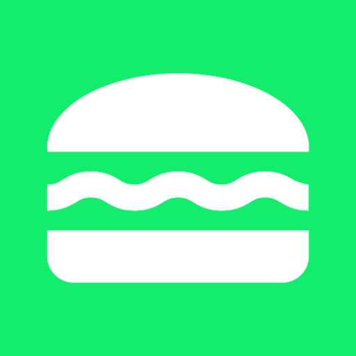
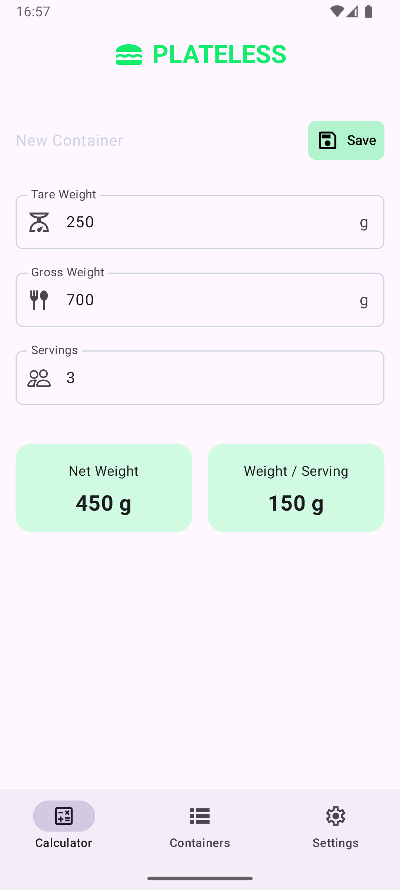

#  Plateless

A Kotlin Multiplatform Mobile app to calculate food portion sizes by weighing food in containers of known tare weight.

## 📸 Screenshots

  
  
   
  <strong>Android</strong>
  &nbsp;&nbsp;&nbsp;&nbsp;&nbsp;&nbsp;&nbsp;&nbsp;&nbsp;&nbsp;&nbsp;&nbsp;&nbsp;&nbsp;&nbsp;&nbsp;&nbsp;&nbsp;&nbsp;&nbsp;&nbsp;&nbsp;&nbsp;&nbsp;&nbsp;&nbsp;&nbsp;&nbsp;&nbsp;&nbsp;&nbsp;
  <strong>iOS</strong>&nbsp;&nbsp;&nbsp;&nbsp;&nbsp;

## Project Structure

Monorepo containing:
- `apps/` – Kotlin Multiplatform Compose applications (Android & iOS)
- `backend/` – Planned Ktor backend service (coming later)

## Current State ✅

**Domain Layer** – Pure business logic with comprehensive unit tests for weight calculations and domain-driven error handling.

**Presentation Layer** – ViewModel with UDF pattern, immutable state management via `StateFlow`, and structured error mapping using sealed classes. MVP design of calculator screen has been implemented with app scaffold including top bar and bottom navigation (not functional yet).

**Architecture** – Separation of concerns following Android best practices: exhaustive error handling, UiText pattern for localization-ready strings and preparation for offline-first repository implementation and dependency injection.

## Next Steps 🎯

- UI layer: refine calculator UI and add container management screen
- Data layer: implement local Room database and offline-first repository 
- Dependency injection: integrate Koin for ViewModel/s and repository
- Backend: implement and integrate Ktor API to allow syncing of saved containers
